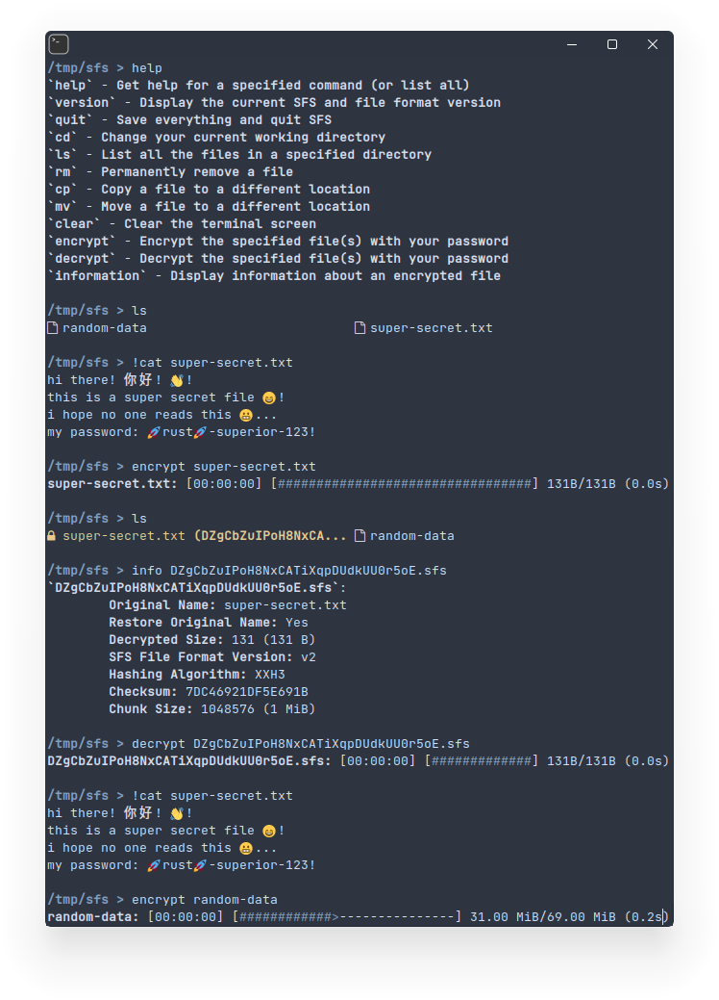

# SFS (SecureFS)
A shell that allows you to encrypt/decrypt your files with a password



SFS encrypts and decrypts files using a fernet (AES-128), generated from a password that you enter every time you open SFS.\
SFS also has its own implementation of commands like `ls`, `cp`, `mv`, `rm`, `clear`, and has its own command/flag parser.

## Installation
- Requirements:
	- Rust (Cargo)

```sh
git clone https://github.com/ErrorNoInternet/sfs
cd sfs
cargo install --path .
```

SFS has only been tested on Linux, and might not work well on Windows or other operating systems. Please [create an issue](https://github.com/ErrorNoInternet/sfs/issues/new) if you run into a problem.
